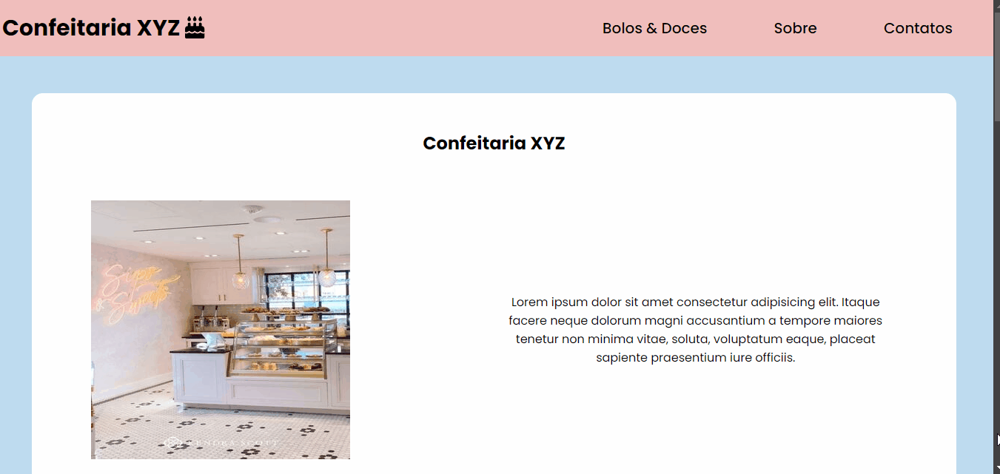
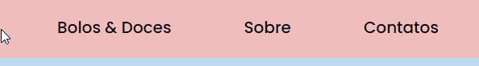
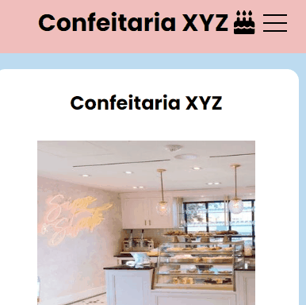
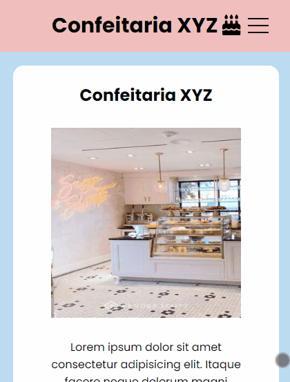
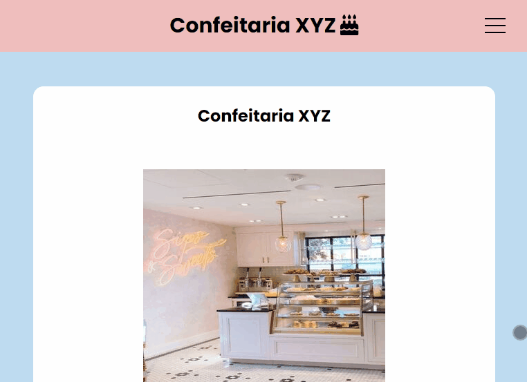

# Confeitaria
Esse é um site que desenvolvi como base para ter um exemplo do que pode ser feito, para servir de ideia para algo parecido, um tipo de "template".

# Tecnologias utilizadas
- HTML;
- CSS.

# Interações com a página
### Menu
O menu tem uma interação com mudança de cores e botões clicáveis. As opções no menu levam as respectivas seções da página.

### Menu "hamburguer"
o menu do cabeçalho se torna um menu hamburguer quando em dispositivos menores, como tables e dispositivos mobile.

### Redes sociais
Os botões das redes socias mudam de cor ao passar o cursor por cima de cada um, por se tratar de um template os botões não levam aos respectivos links que são indicados pelos ícones.

# Responsividade
### Mobile
O projeto está responsivo, se comporta bem em dispositivos mobile (425px).

### Tablet
O projeto também está responsivo em tablets (768px).

